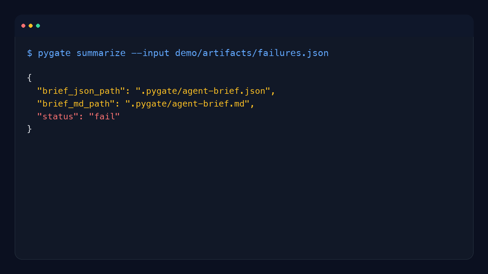

# PyGate

Python CI failures are noisy, tool-specific, and expensive to triage when Ruff, Pyright, and pytest all disagree about what matters first.

PyGate turns those gate results into one deterministic Python quality gate with bounded auto-repair and structured escalation evidence for humans or agents.

- "The PR failed, but I have to dig through Ruff, Pyright, and pytest separately to understand why."
- "We want fail-fast Python CI, not another lint dashboard."
- "Auto-fix should stop when it stops helping instead of thrashing the repo."
- "If repair cannot finish the job, I want a clean escalation artifact instead of a pile of logs."

```bash
pip install pygate-ci
```

```bash
pygate summarize --input demo/artifacts/failures.json
```

```json
{
  "brief_json_path": ".pygate/agent-brief.json",
  "brief_md_path": ".pygate/agent-brief.md",
  "status": "fail"
}
```

**When To Use It**

Use PyGate when you want one deterministic Python CI gate that can normalize Ruff, Pyright, and pytest output, attempt bounded deterministic repair, and escalate with machine-readable evidence when it cannot finish safely.

**When Not To Use It**

Do not use PyGate as a generic lint aggregator, a semantic code fixer, or a replacement for the underlying tools. It is a fail-fast gate-and-escalate wrapper around them.



[](https://github.com/roli-lpci/quick-gate-python/blob/main/LICENSE)
[](https://python.org)
[](https://github.com/roli-lpci/quick-gate-python/actions/workflows/ci.yml)
[](https://pypi.org/project/pygate-ci/)

**PyPI package:** `pygate-ci`  
**CLI command:** `pygate`

---

## Table of Contents

- [Quick Start](#quick-start)
- [What It Does](#what-it-does)
- [Commands](#commands)
- [Artifacts](#artifacts)
- [Repair Loop](#repair-loop)
- [Configuration](#configuration)
- [GitHub Action](#github-action)
- [Limitations](#limitations)
- [Roadmap](#roadmap)
- [Contributing](#contributing)
- [License](#license)

## Quick Start

```bash
# Prerequisites: ruff, pyright, and pytest must be available in your environment
pip install pygate-ci

# Run quality gates on changed files
echo "src/app.py" > changed.txt
pygate run --mode canary --changed-files changed.txt

# Generate agent brief from failures
pygate summarize --input .pygate/failures.json

# Attempt bounded repair
pygate repair --input .pygate/failures.json --max-attempts 3
```

> **Note:** The PyPI package is `pygate-ci` but the CLI command is `pygate`.

## What It Does

PyGate runs deterministic quality gates on your Python project and produces structured, machine-readable artifacts designed for both humans and AI agents.

### Gates

| Gate | Tool | Canary | Full |
|------|------|--------|------|
| **lint** | ruff | yes | yes |
| **typecheck** | pyright | yes | yes |
| **test** | pytest | configurable | yes |

### How It Works

```
Changed Files ──> Run Gates ──> Findings? ──No──> Pass
                                    |
                                   Yes
                                    |
                                    v
                              Repair Loop ──> Improved? ──Fixed──> Pass
                                                  |
                                                  No
                                                  |
                                                  v
                                        Escalate with Evidence
```

1. You tell PyGate which files changed (from your CI diff, PR, etc.)
2. It runs lint, typecheck, and optionally tests
3. Findings are normalized into a unified schema with severity, rule codes, and evidence
4. The repair loop applies safe deterministic fixes (ruff --fix + format)
5. If it can't fix everything, it escalates with structured evidence explaining why

## Commands

```
pygate run --mode canary|full --changed-files <path>
pygate summarize --input .pygate/failures.json
pygate repair --input .pygate/failures.json [--max-attempts N]
```

**Exit codes:** `0` = pass, `1` = fail (`run`), `2` = escalated (`repair`)

## Artifacts

All artifacts are written to `.pygate/`:

| File | Description |
|------|-------------|
| `failures.json` | Structured findings with severity, rule codes, and evidence |
| `run-metadata.json` | Gate execution traces (commands, stdout, stderr, durations) |
| `agent-brief.json` | Priority actions and retry policy for AI agents |
| `agent-brief.md` | Human-readable summary |
| `repair-report.json` | Repair attempt history (on success) |
| `escalation.json` | Escalation reason and evidence (on failure) |

JSON Schema files for all artifact types are available in [`schemas/`](https://github.com/roli-lpci/quick-gate-python/tree/main/schemas) for downstream validation and code generation. See [`demo/artifacts/`](https://github.com/roli-lpci/quick-gate-python/tree/main/demo/artifacts) for sample output.

## Repair Loop

The repair command runs a bounded deterministic repair loop:

1. **Backup** workspace
2. **Fix** via `ruff check --fix` + `ruff format` on scoped files
3. **Re-run** gates to measure improvement
4. **Decide**: pass (done), worsened (rollback), no improvement (escalate)

### Policy Defaults

| Parameter | Default |
|-----------|---------|
| Max attempts | 3 |
| Max patch lines | 150 |
| No-improvement abort | 2 consecutive |
| Time cap | 20 minutes |

### Escalation Codes

| Code | Meaning |
|------|---------|
| `NO_IMPROVEMENT` | 2+ consecutive attempts with no finding reduction |
| `PATCH_BUDGET_EXCEEDED` | Edit exceeded line budget |
| `UNKNOWN_BLOCKER` | Max attempts exhausted |
| `UNRESOLVED_DETERMINISTIC_FAILURES` | Deterministic failures remain after repair |
| `ARCHITECTURAL_CHANGE_REQUIRED` | Structural issues beyond repair scope (reserved) |
| `FLAKY_EVALUATOR` | Gate produces inconsistent results (reserved) |
| `ENVIRONMENT_DRIFT` | Python version or dependency mismatch (reserved) |
| `TEST_FIXTURE_OR_EXTERNAL_DEP` | Tests depend on network, DB, or time (reserved) |

## Configuration

Configure via `pygate.toml` (standalone) or `[tool.pygate]` in `pyproject.toml`:

**pygate.toml:**
```toml
[policy]
max_attempts = 3
max_patch_lines = 150
abort_on_no_improvement = 2
time_cap_seconds = 1200

[commands]
lint = "ruff check --output-format json ."
typecheck = "pyright --outputjson ."
test = "pytest --json-report --json-report-file=.pygate/pytest-report.json -q"

[gates]
test_in_canary = false
```

**Or in pyproject.toml:**
```toml
[tool.pygate.policy]
max_attempts = 3

[tool.pygate.commands]
lint = "ruff check --output-format json ."

[tool.pygate.gates]
test_in_canary = false
```

## GitHub Action

PyGate ships with a composite GitHub Action for CI integration:

```yaml
- uses: actions/checkout@v4
- uses: roli-lpci/quick-gate-python/.github/actions/pygate@main
  with:
    mode: canary          # or "full"
    repair: "true"        # attempt auto-repair on failures
    max-attempts: 3
    python-version: "3.12"
```

The action detects changed files from the PR, runs gates, optionally repairs, and uploads `.pygate/` artifacts. The `post-comment` feature requires `pull-requests: write` permission in your workflow.

## Limitations

- **Deterministic repair only (v1)**: The repair loop uses `ruff --fix` and `ruff format`. It cannot fix type errors, failing tests, or issues requiring semantic understanding.
- **No incremental analysis**: All specified gates run on every invocation. There is no caching or incremental mode.
- **Tool availability**: PyGate requires ruff, pyright, and pytest to be installed in the target environment. It does not install them.
- **Single-repo scope**: Designed for single Python projects, not monorepos with multiple packages.

## Roadmap

- [ ] Model-assisted repair (LLM-powered fixes for type errors and test failures)
- [ ] Coverage gate (fail on coverage drops)
- [ ] Security gate (bandit / safety integration)
- [ ] Incremental mode (only re-run gates on changed files)
- [ ] PyPI trusted publishing via GitHub Actions
- [ ] Plugin system for custom gates

## Contributing

See [CONTRIBUTING.md](https://github.com/roli-lpci/quick-gate-python/blob/main/CONTRIBUTING.md) for development setup and guidelines.

## License

[Apache 2.0](https://github.com/roli-lpci/quick-gate-python/blob/main/LICENSE)
